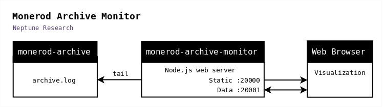

# monero-archive-monitor

Web application for monitoring and visualizing output from [monerod-archive](https://github.com/neptuneresearch/monerod-archive).
 
- [x] :bar_chart: Alt Chains, a graph of the monerod-archive daemon's internal state of alternate blockchains
  
monero-archive-monitor tails [monerod-archive's output file](https://github.com/neptuneresearch/monerod-archive#archive-file) and continuously sends the output data over a web socket to a web browser which renders visualizations.
  
  
  
> monero-archive-monitor is copyright (c) 2018 Neptune Research.  
monero-archive-monitor is offered under the BSD-2-Clause open source license. See [LICENSE](LICENSE) for more information.  

> monero-archive-monitor is a companion application to [monerod-archive](https://github.com/neptuneresearch/monerod-archive).

> monero-archive-monitor was developed for the [Monero Archival Project](https://github.com/mitchellpkt/monero_archival_project).  

---
## Table of Contents
- [Installation](#installation)
- [Operation](#operation)
- [Usage](#usage)
- [Compatibility](#compatibility)
- [Components](#components)

---
# Installation

monero-archive-monitor requires  

**Server**
- Node.js (tested on 10.4.1)
- Npm (tested on 6.1.0)
- monerod-archive-v6

**Client**
- Web browser (tested on Firefox and Chrome)

### 1. Get this repository
[Download latest release](https://github.com/neptuneresearch/monero-archive-monitor/releases) 

or clone with git:

    git clone https://github.com/neptuneresearch/monero-archive-monitor

### 2. Install dependencies
Download the dependency node modules from npm:

    npm install

---
# Operation
## 1. Start the monitor server

    # Optional parameters
    #    static_port_number: default 20000
    #    data_port_number:   default 20001
    #    input_file:         default "/opt/monerodarchive/archive.log"

    npm run start [static_port_number] [data_port_number] [input_file]

## 2. Open the client in a web browser

- [http://localhost:20000/](http://localhost:20000/)

---
# Usage
## Alt Chains graph

The Alt Chains graph displays one bar per alternate chain currently active in the monerod-archive daemon.

---
# Compatibility
monero-archive-monitor is compatible with monerod-archive-v6.

See ["Archive File" in the monerod-archive README](https://github.com/neptuneresearch/monerod-archive#archive-file).

---
# Components

## Node.js web server

- Statically serves the web application to web browsers.
- Hosts a web socket which provides a data feed to the web application.
- Tails the archive output file, sending new data to any established web sockets.

### Dependencies

- [Express](https://expressjs.com) 4.1.5
- [Primus.io](https://github.com/cayasso/primus.io) 4.0.0
- [Ws](https://github.com/websockets/ws) 2.2.0
- [Lodash](https://lodash.com)

*Note* There are Npm/Github vulnerability warnings for these older packages. The server is currently locked into use of older versions due to incompatibility of Primus.io with the latest versions of other libraries like Ws 6.0. This could be resolved by replacing Primus.io with latest Primus and primus-emitter, primus-rooms, etc. (Vulns: debug 2.6.1, fresh 0.5.0, lodash 4.17.4, node-mime 1.3.4, moment 2.17.1; these went away when replace Primus.io package with Primus, but code is needed to re-implement Primus.io under new Primus.) 
  
  
## Web application

- Connects to the monitor data feed web socket.
- Renders visualizations of the data.

### Dependencies

- [Backbone](http://backbonejs.org/)
- [Marionette.js](https://marionettejs.com)
- [jQuery](https://jquery.com)
- [D3](https://d3js.org) v5
- [C3](https://c3js.org) 0.6.7
- [RequireJS](https://requirejs.org)
- [Moment](https://momentjs.com)
- [Underscore](https://underscorejs.org)
- [Fastclick](https://github.com/ftlabs/fastclick)

---
# Changelog

v1
- First release.